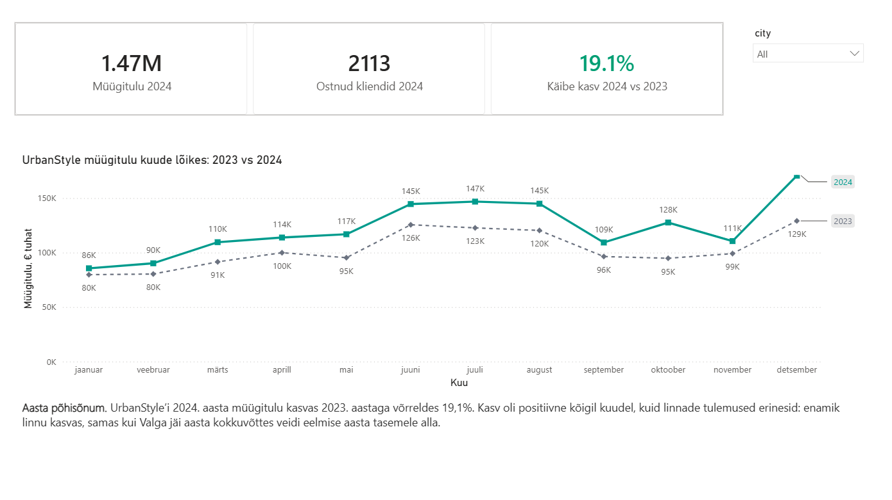
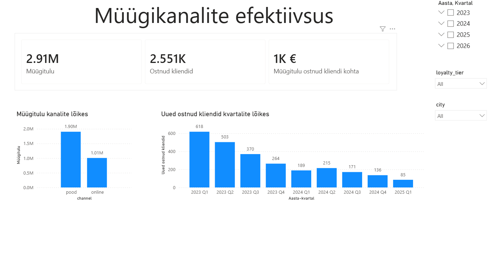

# Nädal 5: visualiseerimise disain — CEO müügidashboard

## Eesmärk

Koostada Power BI Desktopis UrbanStyle’i tegevjuhile selge ühe ekraani juhtimisvaade, mis vastab põhiküsimusele: **kas ettevõte kasvab?**

Nädala ametlik individuaalne ülesanne oli **Roll A — CEO Dashboard**. Pärast esialgse lahenduse esitamist täiendasin dashboard’i reedese sessiooni, saadud tagasiside ja enda järelanalüüsi põhjal. Isiklikus portfoolios on seetõttu lõplik edasiarendatud versioon; grupirepos säilib nädala jooksul esitatud esialgne lahendus.

## Minu roll

Minu ametlik roll grupitöös oli **Roll A — CEO Dashboard**. Koostasin juhtimisvaate, mis ühendab ettevõtte peamised müüginäitajad, aastate võrdluse, kuise trendi ja linnapõhise filtreerimise.

Portfoolio PBIX sisaldab lisaks iseseisva enesearendusena läbitöötatud **Roll B — Marketing Dashboardi**.

## Peamised tulemused

- 2024\. aasta müügitulu oli **1 470 358,02 eurot**.
- Käive kasvas 2023. aastaga võrreldes **19,1%** ehk **235 599,12 eurot**.
- 2024\. aastal tegi ostu **2 113 unikaalset klienti**.
- 2024\. aasta müügitulu ületas 2023. aasta taset kõigil kuudel.
- Enamik linnu kasvas; Valga aastane müügitulu jäi veidi 2023. aasta tasemele alla.
- Määramata linnaga müük jäeti analüüsi sisse, sest selle ärilist tähendust ei olnud võimalik olemasolevate andmete põhjal usaldusväärselt määrata.

## Dashboard’i edasiarendus

Esialgne Roll A lahendus valmis nädala ametliku tööna. Pärast esitlust täiendasin isikliku portfoolio versiooni, et muuta juhtimisvaade selgemaks ja paremini tõlgendatavaks.

Lõplikus versioonis:

- tõstsin KPI-d selgemalt juhtimisvaate fookusesse;
- korrastasin 2023. ja 2024. aasta kuise müügitulu võrdlust;
- täiendasin visuaalset hierarhiat ja värvikasutust;
- kasutasin värvi kõrval ka teksti, joone stiili ja legendi, et aastad oleksid eristatavad;
- kontrollisin telgede skaalasid, et trendi ei võimendataks eksitavalt;
- valideerisin KPI-d ja filtrite mõju eraldi kontrollvaadetes.

Grupirepos säilib esialgne esitatud Roll A versioon. Isiklik portfoolio näitab edasiarendatud lahendust ja selle juurde kuuluvat detailsemat analüüsi.

## Täiendav enesearendus — Marketing Dashboard

Pärast ametliku Roll A töö valmimist töötasin iseseisvalt läbi ka Roll B lahenduse. Selle eesmärk oli süvendada Power BI andmemudeli, kuupäevaseoste, filtrikonteksti ja kliendihankimise mõõdikute kasutamist.

Marketing Dashboard sisaldab:

- müügitulu võrdlust müügikanalite lõikes;
- uute ostnud klientide arengu vaatamist kvartalite lõikes;
- müügitulu ostnud kliendi kohta;
- perioodi, linna ja lojaalsustaseme filtreid;
- detailvaadet klientide arvu ja müügitulu koos analüüsimiseks.

Roll B jaoks lisasin ühise `Calendar`-tabeli ning kasutasin aktiivset ja mitteaktiivset kuupäevaseost. Uute ostnud klientide mõõdikus kasutatakse `USERELATIONSHIP` funktsiooni.

Oluline piirang on, et „uus klient” tähendab siin kliendi esimest ostu olemasolevas andmestikus, mitte tingimata tema absoluutset esimest ostu enne andmestiku algust.

## Järeldus

UrbanStyle’i 2024. aasta müügitulemused näitavad selget kasvu võrreldes 2023. aastaga. Dashboard võimaldab juhtimisvaates hinnata korraga nii aastakasvu, kuist trendi kui ka piirkondlikke erinevusi.

Töö edasiarendamisel muutus minu jaoks oluliseks mitte ainult õige visualiseeringu loomine, vaid ka küsimus, **kas dashboard aitab juhil kiiresti aru saada, mis tulemuse taga toimub ja mida tuleks järgmisena uurida**.

Täiendav Marketing Dashboard laiendas analüüsi kliendihankimise ja müügikanalite suunas ning tõi juurde praktilise kogemuse kuupäevamudeli ja filtrikontekstiga.

## Kasutatud oskused ja tööriistad

- Power BI Desktop
- Supabase / PostgreSQL
- DAX-mõõdikud ja arvutatud veerud
- `Calendar`-tabel ja kuupäevaseosed
- `USERELATIONSHIP`
- KPI-kaardid, joondiagrammid ja kombodiagrammid
- slicer’id ja filtrikontekst
- visuaalne hierarhia
- värvipimeda-sõbralik värvikasutus
- tulemuste valideerimine tabelivaadetes

## AI kasutamine

Kasutasin AI-d DAX-loogika ja Power BI seadistuste kontrollimisel, dashboard’ide kujundusotsuste läbivaatamisel, veaotsingu toetamisel ning dokumentatsiooni ja äritõlgenduste sõnastamisel. Kõik lõplikud mõõdikud, filtrite mõju ja järeldused kontrollisin Power BI-s tegelike tulemuste vastu.

## Artefaktid

- [Power BI tööfail](urbanstyle_week5_dashboard_helen.pbix)
- [Detailne analüüs](analysis.md)
- [Lõplik CEO dashboard](screenshots/v2_urbanstyle_week5_dashboard_helen.png)
- [Lõpliku CEO dashboard’i kontrolltabelid](screenshots/v2_urbanstyle_week5_dashboard_helen_validation_tables.png)
- [Marketing Dashboard](screenshots/v2_urbanstyle_week5_dashboard_helen_roll_b.png)
- [Marketing Dashboard’i detailvaade](screenshots/v2_urbanstyle_week5_marketing_details_helen_roll_b.png)
- [Esialgne esitatud CEO dashboard](screenshots/urbanstyle_week5_dashboard_helen.png)

## Meeskonna ühine töö

- [UrbanStyle’i nädala 5 meeskonnatöö](https://github.com/Kolju3/DACA-group/tree/main/week-5)
