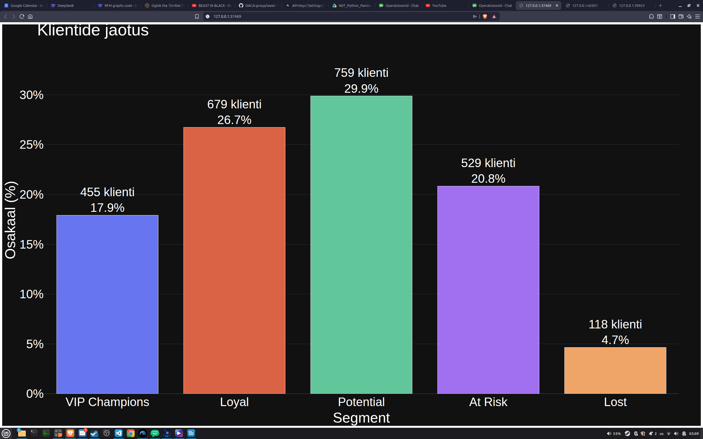
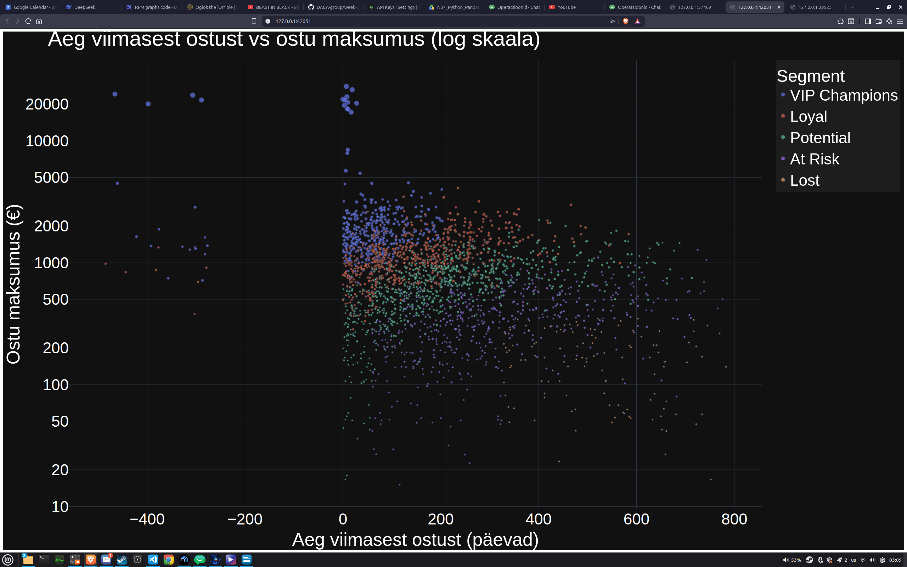
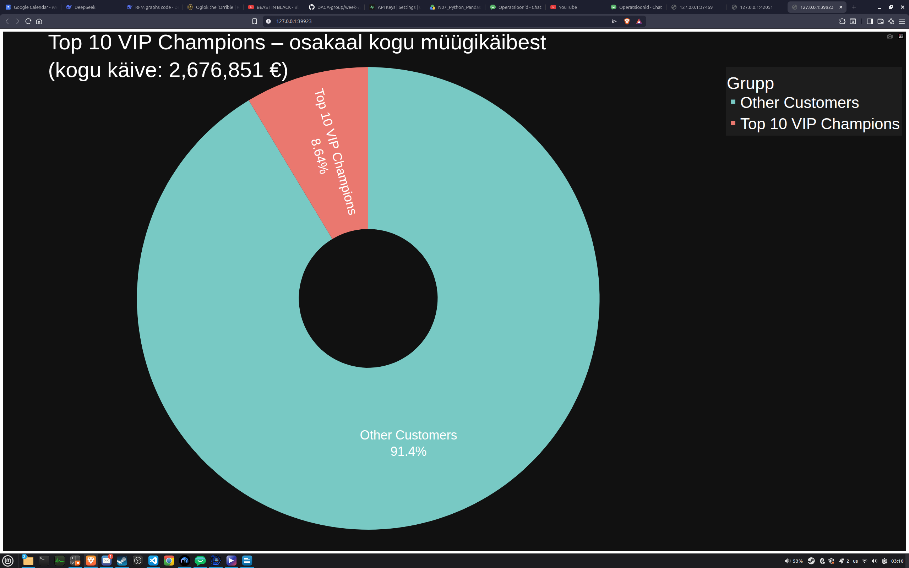

# Nädal 7 grupitöö lõppversioon

See kaust säilitab Nädal 7 lõpliku grupitöö koopiana minu isiklikus portfoolios.

## Grupitöö

Grupi lõplik notebook ühendab Nädal 7 terviktöövoo andmete laadimisest ja puhastamisest kuni RFM-analüüsi ja visualiseerimiseni.

Minu roll grupitöös oli **Roll C - RFM analüüs**.

## Allikas

Algne grupirepo: https://github.com/Kolju3/DACA-group
Lähtecommit: 58940972bd3be40a232870d843e805e30a17e7ee

Grupi algne README on säilitatud failina GROUP_README.md.

## Põhifailid

- urbanstyle_operatsioonid_week7_(a_b_c_d).ipynb - grupi lõplik integreeritud notebook
- rfm_segments.csv - RFM analüüsi tulemused
- Aeg_viimasest_ostust.png - Recency visualiseering
- Klientide_jaotus.png - kliendisegmentide jaotus
- Top_10_osakaal.png - TOP 10 klientide osakaalu visualiseering

## Grupitöö väljundid

### Kliendisegmentide jaotus

### Aeg viimasest ostust

### TOP 10 klientide osakaal

Koopia on lisatud isiklikku portfooliosse on lisatud isiklikku portfooliosse, et säilitada lõplik grupitöö sõltumatult algsest grupirepost.
