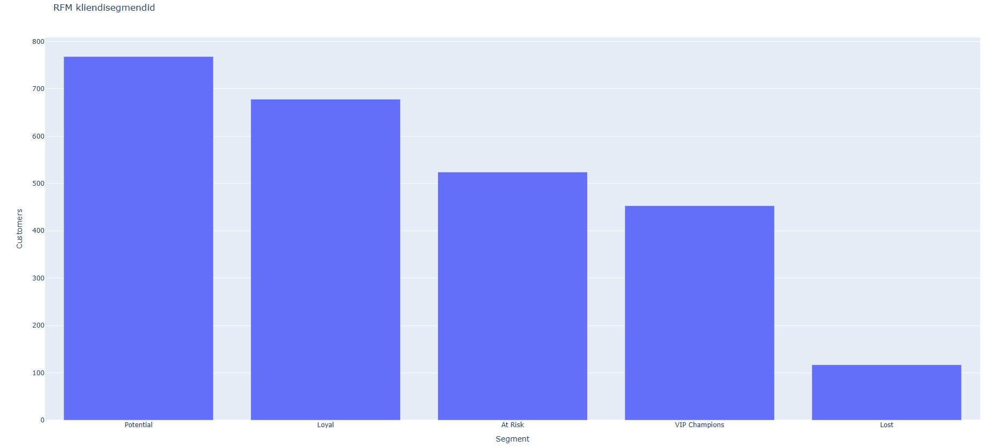

# RFM automatiseerimine

## Eesmärk

See edasiarendus valmis **pärast Nädal 8 grupitöö valmimist ja esitlusel saadud tagasisidet**.

Eesmärk oli viia Nädal 7 RFM-kliendisegmenteerimine olemasoleva Nädal 8 API-pipeline'i sisse nii, et RFM arvutus ja väljundid tekiksid koos ülejäänud pipeline'iga ühe käsuga.

## Täiendus

Olemasolevale pipeline'ile lisati:
- RFM arvutus ja segmentatsioon;
- RFM visualiseering;
- RFM CSV eksport;
- negatiivse Recency kontroll.

Käivitamine:

```powershell
python pipeline.py --date 2025-03-01
```

Sama kuupäevaparameeter juhib nii API lõppkuupäeva kui ka RFM viitekuupäeva.

## Valideeritud tulemus

- puhastatud müügiridu: **8 923**;
- RFM-kliente: **2 540**;
- negatiivseid Recency väärtusi: **0**;
- Frequency summa: **8 923**;
- Monetary summa: **2 669 027,39 €**.

Segmentide jaotus:

| Segment | Kliente |
|---|---:|
| Potential | 768 |
| Loyal | 678 |
| At Risk | 524 |
| VIP Champions | 453 |
| Lost | 117 |

## Väljundid

Olulisemad tõendusfailid `output/` kaustas:
- `rfm_segments_20260813.csv`;
- `rfm_segments.html`;
- `rfm_segments.png`;
- `pipeline_with_rfm_execution_validation.png`.




RFM automatiseerimine on täiendav edasiarendus, mitte ametliku Roll D põhiartefakti asendus.

Detailne tehniline loogika, seos Nädal 7-ga ja kontrollide põhjendus on kirjeldatud [`../../analysis.md`](../../analysis.md) failis.
