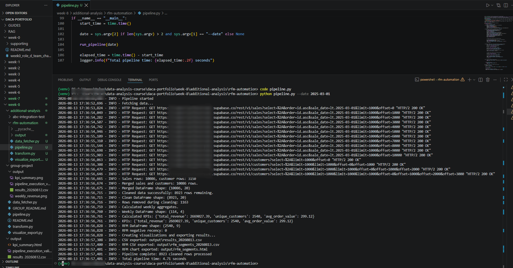

# RFM automatiseerimine

## Eesmärk

See täiendav töö valmis **pärast Nädal 8 grupitöö valmimist ja esitlusel saadud tagasisidet**.

Nädal 7 RFM-analüüs oli varasemalt pandas-põhine analüüs. Nädal 8 edasiarenduse eesmärk oli muuta sama RFM-loogika korduvkäivitatavaks API-pipeline'i osaks.

Aluseks võtsin lõpliku Nädal 8 grupipipeline'i. Olemasolevat A → B → C → D töövoogu ei asendatud, vaid sellele lisati RFM-funktsionaalsus eraldi täiendusena.

```text
Supabase API
→ merge
→ puhastamine
→ KPI-d ja nädalane trend
→ RFM
→ RFM segmendid
→ visualiseerimine
→ CSV / HTML / PNG väljundid
```

## Lisatud funktsionaalsus

### `transform.py`

Lisati:
- kliendipõhine Recency;
- Frequency;
- Monetary;
- R-, F- ja M-skoorid;
- RFM koondskoor;
- RFM segmendid.

Segmendid:

- VIP Champions;
- Loyal;
- Potential;
- At Risk;
- Lost.

### `visualize_export.py`

Lisati:
- RFM segmentide visualiseering;
- RFM tulemuste CSV eksport.

### `pipeline.py`

Olemasolevasse pipeline'i lisati:
- `calculate_rfm()` käivitamine;
- RFM tabeli suuruse logimine;
- negatiivsete Recency väärtuste kontroll;
- RFM graafiku loomine;
- RFM CSV eksport.

## Kuupäevaloogika

Pipeline käivitati:

```powershell
python pipeline.py --date 2025-03-01
```

Sama kuupäevaparameeter juhib:
- API päringu lõppkuupäeva;
- RFM viitekuupäeva.

API loogika kasutab tingimust:

```text
sale_date < 2025-03-01
```

Seega sisend sisaldab müüke kuni 28.02.2025 ning RFM viitekuupäev on 01.03.2025.

See lahendus väldib Nädal 7 ametlikus analüüsis nähtud olukorda, kus andmestikus olid viitekuupäevast hilisemad ostud ja osa Recency väärtusi muutus negatiivseks.

## Valideeritud pipeline'i tulemus

| Kontroll | Tulemus |
|---|---:|
| Puhastatud müügiridu | 8 923 |
| RFM kliente | 2 540 |
| Negatiivseid Recency väärtusi | 0 |
| R-skoori vahemik | 1–5 |
| F-skoori vahemik | 1–5 |
| M-skoori vahemik | 1–5 |
| Frequency summa | 8 923 |
| Monetary summa | 2 669 027,39 € |

Frequency summa kattub puhastatud müügiridade arvuga ning Monetary summa kattub valideeritud pipeline'i käibega. Need kontrollid seovad RFM tulemuse tagasi pipeline'i puhastatud lähteandmetega.

## Segmentide jaotus

| Segment | Kliente |
|---|---:|
| Potential | 768 |
| Loyal | 678 |
| At Risk | 524 |
| VIP Champions | 453 |
| Lost | 117 |
| **Kokku** | **2 540** |

## Väljundid

`output/` kaust sisaldab:

- `results_20260813.csv` — pipeline'i nädalane koondtulemus;
- `rfm_segments_20260813.csv` — kliendipõhised RFM tulemused;
- `rfm_segments.html` — interaktiivne RFM segmentide visualiseering;
- `rfm_segments.png` — staatiline RFM visualiseering;
- `weekly_revenue.html` ja `weekly_revenue.png` — olemasoleva pipeline'i nädalase käibe väljundid;
- `kpi_summary.html` ja `kpi_summary.png` — olemasoleva pipeline'i KPI väljundid;
- `pipeline_with_rfm_execution_validation.png` — RFM-ga täiendatud pipeline'i eduka käivitamise tõendus.

### RFM segmentide visualiseering


### Pipeline'i käivitamise valideerimine



## Peamine tulemus ja õppetund

Edasiarenduse eesmärk ei olnud lihtsalt Nädal 7 koodi kopeerimine uude kausta. Oluline oli viia RFM olemasoleva automatiseeritud töövoo sisse nii, et:

- sama sisendiperiood juhiks nii API päringut kui RFM-arvutust;
- olemasolevad KPI-d jääksid muutumatuks;
- RFM oleks kontrollitav pipeline'i teiste väljundite vastu;
- tulemus tekiks ühe käsuga koos ülejäänud väljunditega.

See näitab arengut ühekordsest analüüsist korduvkäivitatava analüüsiprotsessi suunas.

## Seos Nädal 8 põhitööga

RFM automatiseerimine on **täiendav edasiarendus**, mitte ametliku Roll D põhiartefakti asendus.

Ametlik grupipipeline on säilitatud eraldi `group-project/` kaustas ning Nädal 8 põhiartefakt on põhikausta `pipeline.py`.

Nädalaülene protsess, integratsioonitest ja RFM edasiarenduse koht õppimisloos on kirjeldatud [`../../analysis.md`](../../analysis.md) failis.
