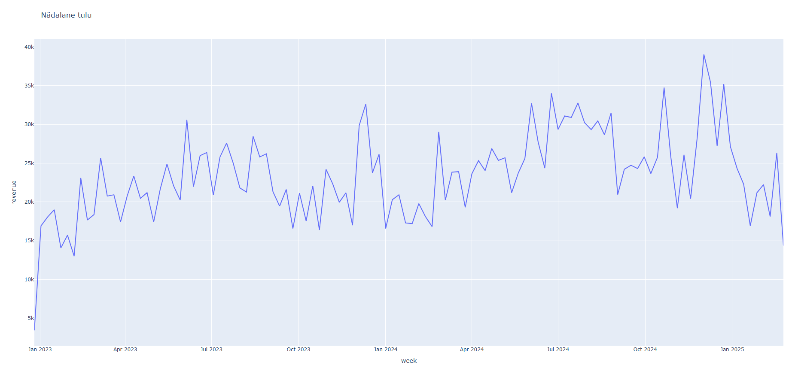

# Week 8 Additional Analysis — RFM Automation

## Eesmärk

Täiendasin Week 8 automatiseeritud pipeline'i pärast grupitöö esitlusel saadud tagasisidet, et siduda Week 7 RFM-analüüs Week 8 Supabase API-põhise töövooga.

Olemasolev Week 8 pipeline ja selle funktsioonid jäid aluseks. Lisatud on ainult RFM-arvutus, RFM-segmentide visualiseerimine ja RFM-tulemuste eksport.

## Töövoog

Supabase API → merge → clean → weekly KPI → RFM → visualiseeringud → CSV-väljundid

Käivitamine:

python pipeline.py --date 2025-03-01

Sama kuupäev juhib nii API filtrit kui ka RFM reference date väärtust:

- API: sale_date < 2025-03-01
- RFM reference date: 2025-03-01
- analüüsiperioodi viimane müügipäev: 2025-02-28

See väldib negatiivseid Recency väärtusi.

## Valideeritud tulemused

| Kontroll | Tulemus |
|---|---:|
| Puhastatud müügiridu | 8 923 |
| RFM kliente | 2 540 |
| Negatiivne Recency | 0 |
| Frequency summa | 8 923 |
| Monetary summa | 2 669 027,39 € |
| Puuduva segmendiga kliente | 0 |

### RFM segmendid

| Segment | Kliente |
|---|---:|
| Potential | 768 |
| Loyal | 678 |
| At Risk | 524 |
| VIP Champions | 453 |
| Lost | 117 |
| **Kokku** | **2 540** |

## Väljundid

Pipeline loob olemasolevad Week 8 väljundid ning lisaks RFM-segmentatsiooni tulemused.

### Peamised KPI-d

### Nädalane tulu

### RFM kliendisegmendid

### Andme- ja interaktiivsed väljundid

- `output/results_20260813.csv` — nädalased koondtulemused
- `output/kpi_summary.html` — interaktiivne KPI-vaade
- `output/weekly_revenue.html` — interaktiivne nädalase tulu graafik
- `output/rfm_segments_20260813.csv` — kliendipõhised RFM tulemused
- `output/rfm_segments.html` — interaktiivne RFM segmentide visualiseering

### Pipeline'i valideerimine

Kogu laiendatud pipeline valideeriti käsuga:

`python pipeline.py --date 2025-03-01`

## Õppetund

Olemasoleva analüüsiloogika automatiseerimiseks ei olnud vaja Week 7 RFM-i ümber kirjutada. Sama puhastatud andmestik ja sama RFM-loogika ühendati olemasoleva Week 8 pipeline'iga ning üks kuupäevaparameeter juhib nüüd nii andmete pärimist kui ka RFM arvutuse viitekuupäeva.
